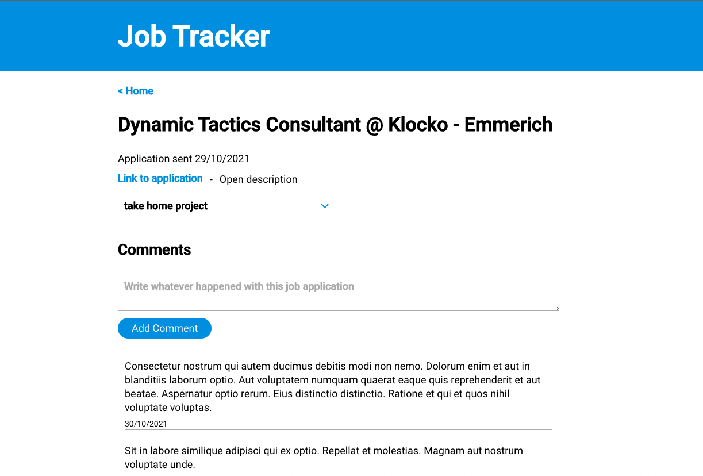
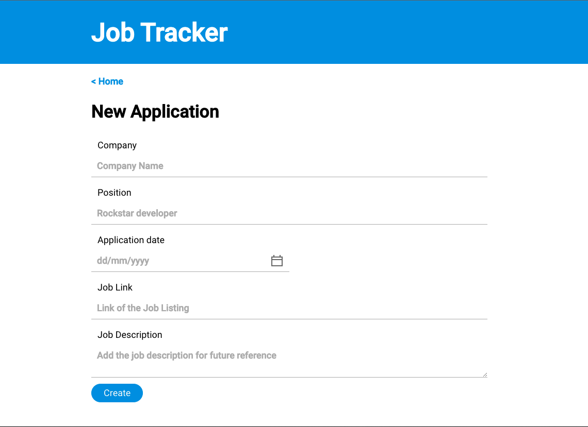

# Job Tracker Application

Web application to track your job applications.

* A user can create a new application
* A user can see all the applications
* A user can see the details of one application
* A user can add comments to one application
* A user can change the status of one application

## Development

There are two main folders.

* "job-tracker-backend" is the api project built with [Express](https://expressjs.com/).
* "job-tracker-frontend" is the frontend project built with [create-react-app](https://reactjs.org/docs/create-a-new-react-app.html).

### Setup

Go into each folder and run `npm install`.

### Run project

Make sure you run the setup first.

First, run the backend:

* Go into the folder "job-tracker-backend".
* Execute `npm run start:dev`.

Then, in parallel, in another terminal tab, run the frontend:

* Go into the folder "job-tracker-frontend".
* Execute `npm start`.

**Visit [Localhost 3000](http://localhost:3000/) to see it in action.**

## Screenshots

## Testing

I used the testing setup provided by "create-react-app" to perform a unit test of the main component as well as a helper.

To run the test:

* Go into the folder "job-tracker-frontend".
* Execute `npm run test`.
